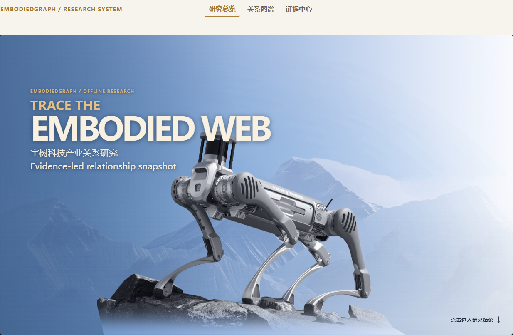
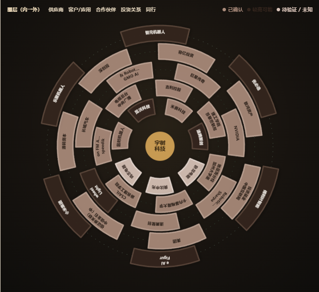
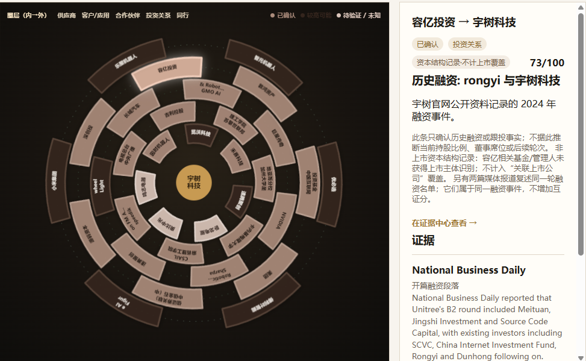
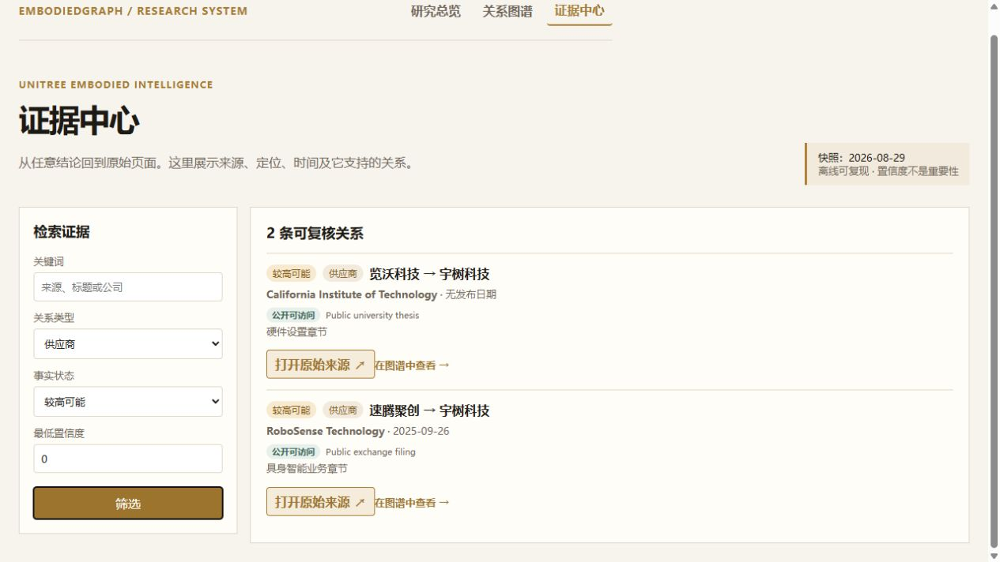
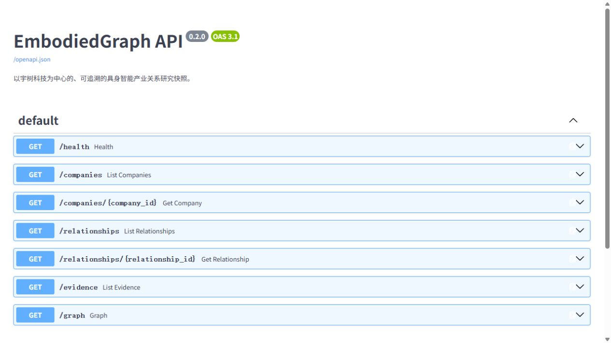

# EmbodiedGraph：宇树科技产业关系研究快照

> 一个能够区分“宇树真实产业关系、间接证据与市场传闻”的可追溯研究系统。

EmbodiedGraph 以宇树科技为中心，将产业关系、原始证据、时间边界和不确定性放在同一套可查询的数据模型中。它不是“关联公司名单”，而是一个离线可复现的研究快照：每一条关系都必须说明关系方向、证据来源、置信度及不能外推的边界。

> **研究用途与非投资建议声明**：本项目是基于公开信息的研究、演示与复现工具，不构成投资建议、交易建议、证券分析报告、荐股或任何形式的收益承诺。置信度仅衡量证据的可追溯性与可靠度，不代表商业规模、公司重要性、估值、股价走势、投资价值或未来表现。使用者应自行核验原始来源并独立判断。

## 项目亮点

- 34 条可复核关系记录：供应商、客户/应用、合作伙伴、投资关系各 7 条，同业 6 条；研究缺口不计入关系数。
- 关系状态区分 `confirmed`、`probable`、`unverified`、`unknown`；页面不会把待验证线索展示成已确认事实。
- 每条关系至少关联一条证据，证据卡可直接打开原始来源。
- 关系图谱支持按关系类型、事实状态、最低置信度筛选；点击连线查看证据，图谱与证据中心可以双向跳转。
- FastAPI JSON API、离线 CLI、SQLite 快照和 Pytest 回归测试使用同一套数据。

## 研究范围

研究对象为宇树科技及其公开可追溯的产业关系，研究快照截点为 **2026-08-29**。

### “关联上市公司”口径审计

关系总数与“关联上市公司覆盖”是两个不同的统计口径，不能混用。

- **上市公司/集团主体**：可以作为“关联上市公司”覆盖计数。当前融资关系中，美团（3690.HK）属于该口径；宇树招股材料还用于核对其关联投资主体的实体归属。
- **上市公司关联投资主体**：实际出资人不是上市公司本体，但存在可公开复核的上市公司控制/全资子公司关系。当前中信金石/金石成长仅以“中信证券关联投资主体”表述；不写成“中信证券直接出资”。
- **非上市资本结构记录**：源码资本、深创投、容亿、敦鸿资产及中国互联网投资基金保留为历史融资/跟投事实，但**不计入“关联上市公司”覆盖**，也不会被用来满足该范围要求。

API 的每条融资关系都返回 `scope_class`：`listed_issuer_or_group`、`listed_group_affiliate` 或 `nonlisted_capital_record`。网页关系详情同样显示该标签。这样，34 条关系记录仍可完整还原公开资本事件，但 reviewer 可以单独核算真正满足上市公司口径的主体，避免把基金机构误作上市公司。

| 关系类型 | 含义 | 当前数量 |
|---|---|---:|
| `supplier` | 向宇树提供组件、模组或相关产品的主体 | 7 |
| `customer` | 采购、部署或以宇树产品开展研究/应用的主体 | 7 |
| `partner` | 共同研发、战略合作、授权经销或生态协作主体 | 7 |
| `investor_or_investee` | 宇树官网披露的历史融资方 | 7 |
| `peer` | 在相近产品与市场中形成的同业判断 | 6 |

`peer` 关系通常基于产品定位和行业材料推断，而非双方共同声明的“竞争关系”，因此在图谱中默认以虚线呈现。

### 多角色主体与研究缺口

- 同一主体可以拥有多种关系角色。以速腾聚创为例：交易所文件支持其与宇树的公开合作；系统同时保守保留“激光雷达供应候选”记录。两者分别表达合作披露与供应可能性，不互相推出供货合同、排他关系或竞争关系。
- 览沃科技的供应候选来自加州理工论文中的单机硬件配置：一台 Unitree G1 使用 Livox Mid-360。这是第三方使用记录，不是宇树或览沃的供货声明，不能据此确认 OEM 供货、长期采购或排他关系。
- `Research log`、无原始链接的检索笔记和待补证条目不进入 `relationships`，不参与关系总数、图谱节点或可信度统计；它们在证据中心的“已知空白 / 待研究”中单列。

## 产品页面

启动后访问 `http://127.0.0.1:8000`。

1. **研究总览**：展示实体数、关系数、已确认比例、待复核记录与研究结论。
2. **关系图谱**：宇树居中、关联方环绕；实线表示已确认关系，虚线表示较高可能、待验证或未知关系。连线有扩展点击区，点击后可查看证据详情。
3. **证据中心**：支持关键词、关系类型、事实状态、最低置信度筛选；每条卡片都可打开原始来源并跳转回图谱中的对应关系。

## 产品截图

以下截图均由本地离线快照生成，用于交付复核；数据、网页与 API 读取同一份 SQLite 数据库。

| 研究总览 | 关系图谱 |
|---|---|
|  |  |

| 关系详情 | 证据筛选 |
|---|---|
|  |  |

| API 文档 |
|---|
|  |

## 置信度与判断边界

置信度衡量的是**证据可靠度**，不代表商业规模、公司重要性或投资建议。

| 指标 | 满分 |
|---|---:|
| 来源权威性 | 35 |
| 关系表述直接性 | 25 |
| 交叉验证 | 15 |
| 信息时效性 | 15 |
| 实体识别准确性 | 10 |
| 冲突信息 | 扣分项 |

交叉验证按**单条关系的不同有效来源 URL**计算：

- 只有一个有效 URL：不获得交叉验证加分。
- 两个不同 URL：加 8 分。
- 三个及以上不同 URL：加 15 分。
- 同一公告列出多家主体时，它可以分别支持多条关系，但不会被重复计算为多份交叉验证。
- 例如 Associated Press 的同一段 `Shipment paragraph` 同时支持智元机器人、傅利叶智能和 Figure AI 的同业判断；三条关系各自可追溯到该报道，但每条的交叉验证均为 0，不会因同源拆分获得额外分数。

信息时效性规则：有发布日期的证据按发布日期评估；缺少发布日期时，`retrieved_at` **只用于复现快照，不参与时效性评分，也不当作“最新”处理**。只要一条关系引用的任一证据缺少发布日期，该关系的 `recency` 即固定封顶为 **5/15**；不会以抓取日期替代发布时间。因此无发布日期的高校页面、经销公告或论文硬件记录会保留，但其总置信度会被保守下调。

证据定位字段统一使用中文短语（如“开篇段落”“硬件设置章节”）。文章来源标题、原文摘录仍保留原始语言，便于 reviewer 对照原文。

### 评分复算示例：禾赛科技 → 宇树科技（`rel-01`）

页面展示该关系为 **73/100**。其唯一主证据为禾赛科技年报中的宇树客户披露（`e4`），因此可以不看代码直接复算：

| 维度 | 得分 | 本条判断依据 |
|---|---:|---|
| 来源权威性 | 32 / 35 | 交易所公开的公司年报，属于一手公开披露。 |
| 关系表述直接性 | 22 / 25 | 年报直接说明宇树选择其激光雷达，但未披露合同金额、长期采购或排他性。 |
| 交叉验证 | 0 / 15 | 当前只有一条独立有效 URL；没有因其他关系复用来源而加分。 |
| 信息时效性 | 10 / 15 | 证据有公开发布日期，但并非本快照年度内的实时信息。 |
| 实体识别准确性 | 9 / 10 | “Hesai Technology”与“Unitree”主体可直接对应。 |
| 冲突信息扣分 | −0 | 未保留与该具体披露相冲突的公开证据。 |
| **合计** | **32 + 22 + 0 + 10 + 9 − 0 = 73 / 100** | 分数表示证据可靠度，不表示采购规模或商业重要性。 |

### 评分复算示例：美团关联主体 → 宇树科技（`rel-22`）

页面展示该历史融资关系为 **81/100**。这也是“同源文章复用不等于多份互证”的完整示例：宇树官网 B2 轮公告（`e12`）、每日经济新闻（`e29`）和中国证券报（`e30`）都在复述**同一轮融资事件**，三者只能算作 **1 个来源组**；上交所招股材料（`e34`）则独立核对美团关联主体的实体归属。因此本条只有两个独立来源组，交叉验证为 8 分而非 15 分。

| 维度 | 得分 | 本条判断依据 |
|---|---:|---|
| 来源权威性 | 32 / 35 | 主证据为宇树官网公开的 B2 轮融资披露。 |
| 关系表述直接性 | 22 / 25 | 披露直接列出美团关联主体参与该历史融资事件；不外推为当前持股或直接投资。 |
| 交叉验证 | 8 / 15 | `e12`、`e29`、`e30` 同属一个融资事件来源组；`e34` 为独立交易所文件，共两个独立来源组。 |
| 信息时效性 | 10 / 15 | 关系事件发布日期明确，但属于 2024 年历史融资。 |
| 实体识别准确性 | 9 / 10 | 上交所材料可核对美团（3690.HK）关联主体的归属。 |
| 冲突信息扣分 | −0 | 未保留与该历史融资事实相冲突的公开材料。 |
| **合计** | **32 + 22 + 8 + 10 + 9 − 0 = 81 / 100** | 81 分只表达历史融资事实与实体归属的可复核度，不代表当前持股、控制权或商业重要性。 |

### 证据访问与许可限制

每条 `evidence` 都返回 `access_status`（标准化访问状态）与 `access_note`（具体访问说明）；证据中心会以标签展示二者。可选状态如下：

| `access_status` | 含义与处理方式 |
|---|---|
| `public` | 公开、无需登录访问；可保留 URL、必要短摘录和定位信息。 |
| `login_required_excluded` | 需要账号或登录；不采集正文，仅可在已知空白中说明。 |
| `paywalled_excluded` | 付费墙或订阅内容；不采集正文，仅可在已知空白中说明。 |
| `not_external_source` | 研究检索笔记、无原始 URL 或其他非外部来源；不构成关系证据，不进入关系数与评分。 |

当前离线快照只纳入 `public` 证据；非公开或不可验证记录均以“已知空白 / 待研究”方式单列，绝不作为已确认关系的依据。

关系成熟度从低到高为：`市场传闻`、`接触或送样`、`测试验证`、`小批量供货`、`稳定量产`、`双方确认`。

## 数据模型

SQLite 中包含四张核心表：

| 表 | 作用 |
|---|---|
| `companies` | 公司、机构、高校等实体及其别名 |
| `relationships` | 双方、方向、类型、状态、成熟度、时间、评分与不确定性 |
| `evidence` | 发布方、URL、发布日期、获取日期、证据定位、摘录与可访问性 |
| `snapshots` | 固定快照的时间与许可说明 |

多对多表 `relationship_evidence` 将每条关系与其证据连接起来。

主要离线数据入口：

- `data/mvp_snapshot.json`：基础实体、基础证据和快照元数据。
- `app/db.py`：经人工核对后的补充关系、证据与 SQLite 加载逻辑。
- `data/embodiedgraph.db`：由加载脚本生成的本地数据库，不依赖联网。

## 安装与启动

前提：Python 3.11 或更高版本。

本项目为纯本地 SQLite 离线快照，**无需配置任何环境变量、API 密钥、账号凭据或外部 API 服务**；启动、CLI 查询和测试均不会重新抓取外部网站。

```powershell
git clone <repository-url>
cd unitree-embodiedgraph
python -m venv .venv
.\.venv\Scripts\Activate.ps1
python -m pip install -r requirements.txt
python scripts\load_snapshot.py
python -m uvicorn app.main:app --reload
```

随后打开：

- 网页：`http://127.0.0.1:8000`
- API 文档：`http://127.0.0.1:8000/docs`

如 PowerShell 阻止激活虚拟环境，可不激活，改为使用 `.\.venv\Scripts\python.exe` 执行后续命令。

## API

| 方法 | 路径 | 说明 |
|---|---|---|
| `GET` | `/health` | 服务与快照状态 |
| `GET` | `/companies` | 实体列表与分页查询 |
| `GET` | `/companies/{id}` | 单个实体及其关系 |
| `GET` | `/relationships` | 关系列表、筛选与分页 |
| `GET` | `/relationships/{id}` | 单条关系及完整证据 |
| `GET` | `/evidence` | 证据列表，可按关系 ID 查询 |
| `GET` | `/graph` | 图谱节点与边数据 |

`/relationships` 支持参数：

```text
company
relationship_type
status
min_confidence
start_date
end_date
page
page_size
```

示例：

```powershell
# 查询所有供应商候选
Invoke-RestMethod "http://127.0.0.1:8000/relationships?relationship_type=supplier&page_size=100"

# 查询已确认且置信度不低于 70 的关系
Invoke-RestMethod "http://127.0.0.1:8000/relationships?status=confirmed&min_confidence=70&page_size=100"

# 获取图谱数据
Invoke-RestMethod "http://127.0.0.1:8000/graph?relationship_type=partner"
```

## CLI（离线脚本化入口）

CLI 与 HTTP API 读取同一份 `data/embodiedgraph.db` 快照，输出为 UTF-8 JSON；无需启动网页服务。所有查询均支持明确的输入校验，非法关系类型、日期格式、分页范围或不存在的 ID 将返回非零退出码和 JSON 错误信息。

```powershell
# 查询公司 / 机构（支持名称或别名检索、分页）
python -m app.cli companies --query Unitree --page 1 --page-size 20

# 查询关系：公司、类型、事实状态、置信度、时间范围、分页
python -m app.cli relationships --company unitree --relationship-type supplier --status confirmed --min-confidence 70 --page 1 --page-size 20

# 查询单条关系及其完整证据，或只查询该关系的证据
python -m app.cli relationship rel-01
python -m app.cli evidence --relationship-id rel-01

# 获取图谱节点与边；查看当前快照元数据
python -m app.cli graph --relationship-type partner --min-confidence 60
python -m app.cli snapshot-info
```

完整命令帮助：`python -m app.cli --help`。

## 测试

```powershell
python -m pytest -q
```

测试覆盖：

- 公司查询与分页。
- 关系类型、状态、置信度筛选和图谱查询。
- CLI 的公司、关系、图谱与证据查询，以及分页边界校验。
- 无效关系类型与不存在实体的错误边界。
- 评分上限、缺少证据不能标为 `confirmed`。
- 同一来源被多条关系复用时，不重复获得交叉验证加分。
- 证据缺口可被读取。
- 发布者名称标准化。
- 34 条可复核关系的快照验收；Research log 等待补证记录单列为“已知空白 / 待研究”，不计入关系数。

其中，`test_invalid_type_and_missing_record`、`test_score_and_missing_evidence_boundary`、`test_local_snapshot_contains_evidence_gap` 与 `test_cli_rejects_invalid_pagination` 是明确的失败/边界测试：它们分别覆盖无效输入、缺少证据、来源不可用与分页越界，避免系统将失败状态静默展示为有效研究结论。

## 数据来源与合规

优先级由高到低：

1. 宇树、关系方、交易所、政府或高校的公开页面、公告和文档。
2. 权威媒体与公开行业材料。
3. 明确标为待验证的二级研究线索。

项目仅保存公开、无需登录访问的信息与必要的短摘录，用于定位来源；不抓取登录后内容、付费数据库、个人信息、客户机密或受限内容。网页和测试使用的是固定本地快照，启动过程不会重新爬取外部网站。

## 已知限制

- 快照不代表实时关系网络；页面中的“最近更新”是快照更新时间，不是实时监控结果。
- 单条官方公告可确认特定事件，但不当然说明长期合作、当前持股、订单金额或排他性。
- 同业关系是研究判断，除非有直接公开表述，否则保持虚线和相应不确定性说明。
- 个别供应链线索来源于公开行业材料，仅作为待验证候选，不应理解为已确认量产供货。

### 已知空白与后续数据质量改进

- `Research log`、无原始 URL、来源暂不可访问或尚不能定位原文段落的条目，均只在“已知空白 / 待研究”中保留，**不进入 34 条关系记录、不进入图谱，也不参与置信度统计**。
- 后续优先为待验证供应链补充宇树或关系方的双方直接披露；对于只有第三方部署记录的关系，只有获得直接供货、采购或合作表述后才可能上调状态。
- 优先补齐发布日期、访问/许可说明和中文定位字段；缺少发布日期的记录继续按保守时效规则处理，不以抓取日替代发布时间。
- 对同一融资公告或同一篇行业报道复用的关系，后续优先寻找独立原始来源；在获得独立来源前，同源报道不会增加交叉验证分数。

## 更新数据的流程

1. 人工打开公开来源，记录 URL、发布者、发布日期、获取日期、可定位段落与访问限制。
2. 确认实体名称、关系方向与分类；无法直接确认时使用 `probable`、`unverified` 或 `unknown`。
3. 将证据与关系补入 `data/mvp_snapshot.json` 或 `app/db.py`，并写清楚不确定性。
4. 运行 `python scripts/load_snapshot.py` 重建 SQLite 快照。
5. 运行 `python -m pytest -q`，再在网页中检查筛选、连线详情和原始链接。

## AI 使用说明

AI 可用于检索线索、摘要、数据结构化、界面和测试代码辅助。每条最终记录仍需由项目负责人进行人工复核：检查来源可访问性、实体名称、关系方向、原文定位、评分与状态边界；AI 不直接决定事实真伪，也不将市场传闻自动升级为已确认关系。

使用 AI、编码 Agent 或检索工具时，**不得输入或上传 API 密钥、账号凭据、个人数据、客户机密、未公开业务数据或任何未获授权的材料**。本项目仅处理公开、无需登录访问的网页与文件；最终研究和工程判断由项目负责人承担。
